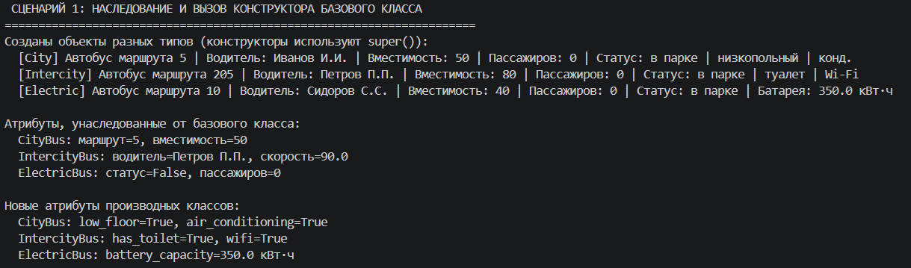
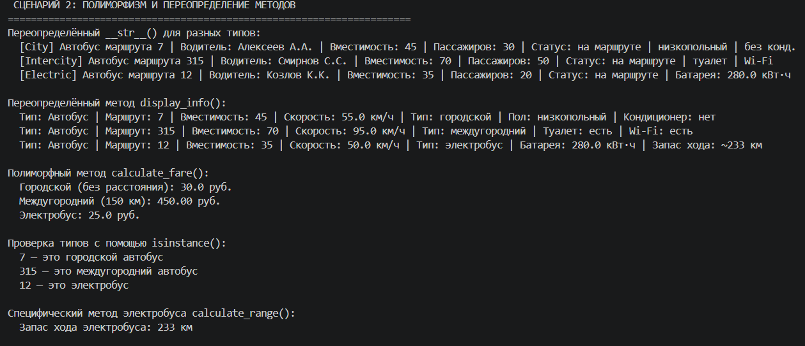
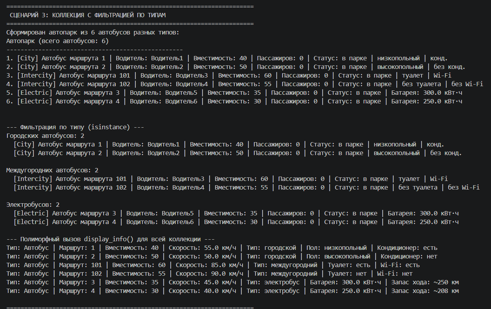
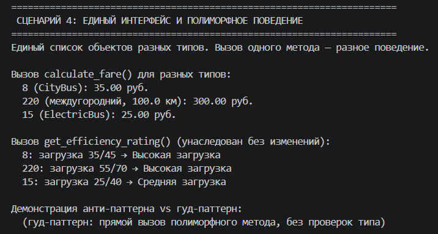
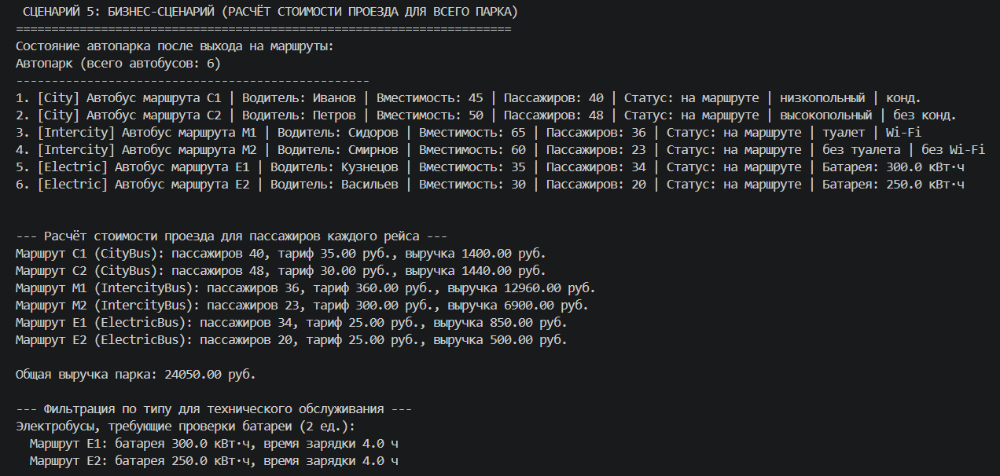

# Лабораторная работа №3  
## Наследование и иерархия классов (Python)

### Выбранная предметная область  
**Транспорт**

### Реализованная иерархия классов  
Базовый класс: **Bus** (из ЛР-1)  
Производные классы:  
- **CityBus** (городской автобус)  
- **IntercityBus** (междугородний автобус)  
- **ElectricBus** (электробус)  

Расширенная коллекция: **Fleet** (с поддержкой фильтрации по типам и полиморфного поведения)

---

## Краткое описание классов

### Базовый класс `Bus`  
Содержит общие атрибуты и методы для всех автобусов (номер маршрута, вместимость, скорость, водитель, пассажиры, статус). Добавлены полиморфные методы:
- `display_info()` – возвращает строку с базовой информацией об автобусе.
- `calculate_fare(distance)` – расчёт стоимости проезда (в базовом классе выбрасывает `NotImplementedError`).

### Производные классы  

#### `CityBus`  
- **Новые атрибуты:** `low_floor` (низкопольный), `has_air_conditioning` (кондиционер).  
- **Новые/переопределённые методы:**  
  - `calculate_fare()` – фиксированный тариф, зависит от наличия кондиционера.  
  - `display_info()` – добавляет информацию о типе, поле и кондиционере.  
  - `__str__()` – префикс `[City]` и дополнительные характеристики.

#### `IntercityBus`  
- **Новые атрибуты:** `has_toilet` (туалет), `wifi_available` (Wi-Fi).  
- **Новые/переопределённые методы:**  
  - `calculate_fare(distance)` – стоимость зависит от расстояния и наличия Wi-Fi.  
  - `display_info()` – добавляет информацию о туалете и Wi-Fi.  
  - `__str__()` – префикс `[Intercity]` и доп. характеристики.

#### `ElectricBus`  
- **Новые атрибуты:** `battery_capacity` (ёмкость батареи, кВт·ч), `charging_time` (время зарядки, ч).  
- **Новые/переопределённые методы:**  
  - `calculate_fare()` – сниженный экологический тариф.  
  - `calculate_range()` – расчёт запаса хода.  
  - `display_info()` – добавляет ёмкость батареи и запас хода.  
  - `__str__()` – префикс `[Electric]` и ёмкость батареи.

### Коллекция `Fleet` (расширенная версия из ЛР-2)  
Добавлены методы фильтрации по типам (используют `isinstance()`):
- `get_city_buses()` – список только городских автобусов.  
- `get_intercity_buses()` – список только междугородних автобусов.  
- `get_electric_buses()` – список только электробусов.  

Добавлен метод `process_all()` – демонстрирует полиморфное поведение, вызывая `display_info()` для всех объектов коллекции.

---

## Основные методы классов (таблица)

| Класс          | Метод                          | Описание |
|----------------|--------------------------------|----------|
| **Bus**        | `display_info()`               | Возвращает базовую информацию об автобусе |
|                | `calculate_fare(distance)`     | Базовый метод (не реализован) |
| **CityBus**    | `__init__(..., low_floor, has_air_conditioning)` | Конструктор с вызовом `super()` |
|                | `calculate_fare()`             | Фиксированная стоимость проезда |
|                | `display_info()`               | Расширенная информация |
| **IntercityBus**| `__init__(..., has_toilet, wifi_available)` | Конструктор с вызовом `super()` |
|                | `calculate_fare(distance)`     | Стоимость по расстоянию |
|                | `display_info()`               | Расширенная информация |
| **ElectricBus**| `__init__(..., battery_capacity, charging_time)` | Конструктор с вызовом `super()` |
|                | `calculate_fare()`             | Фиксированная стоимость (экотариф) |
|                | `calculate_range()`            | Запас хода на одной зарядке |
|                | `display_info()`               | Расширенная информация |
| **Fleet**      | `get_city_buses()`             | Фильтрация по типу CityBus |
|                | `get_intercity_buses()`        | Фильтрация по типу IntercityBus |
|                | `get_electric_buses()`         | Фильтрация по типу ElectricBus |
|                | `process_all()`                | Полиморфный вызов `display_info()` |

---

## Демонстрация работы (demo.py)

### Сценарий 1 — Наследование и вызов конструктора базового класса
**Что демонстрируется:**  
- Создание объектов трёх производных классов.  
- Использование `super().__init__()` для инициализации общих атрибутов.  
- Доступ к унаследованным и новым атрибутам.

### Сценарий 2 — Полиморфизм и переопределение методов
**Что демонстрируется:**  
- Переопределённые `__str__()` и `display_info()`.  
- Полиморфный вызов `calculate_fare()` с разным поведением.  
- Проверка типов с помощью `isinstance()`.  
- Специфический метод `calculate_range()` у электробуса.

### Сценарий 3 — Коллекция с фильтрацией по типам
**Что демонстрируется:**  
- Добавление в коллекцию объектов разных типов.  
- Фильтрация коллекции по типам с помощью `isinstance()`.  
- Полиморфный вызов `display_info()` для всех объектов через `process_all()`.

### Сценарий 4 — Единый интерфейс и полиморфное поведение
**Что демонстрируется:**  
- Единый список объектов разных типов.  
- Вызов одного и того же метода (`calculate_fare()`, `get_efficiency_rating()`) даёт разные результаты в зависимости от типа.  
- Отсутствие проверок типа в клиентском коде (гуд-паттерн).

### Сценарий 5 — Бизнес-сценарий (расчёт выручки парка)
**Что демонстрируется:**  
- Практическое использование полиморфизма для расчёта стоимости проезда по всему парку.  
- Фильтрация электробусов для технического обслуживания.

---

## Выводы  
В ходе выполнения лабораторной работы освоены:
- механизм наследования и создание иерархии классов;
- использование `super()` для вызова конструктора базового класса;
- переопределение методов (`__str__`, `display_info`, `calculate_fare`);
- полиморфизм и работа с коллекцией, содержащей объекты разных типов;
- фильтрация коллекции по типам с помощью `isinstance()`;
- реализация общего интерфейса поведения через базовый класс.

Код соответствует требованиям задания на оценку «5».