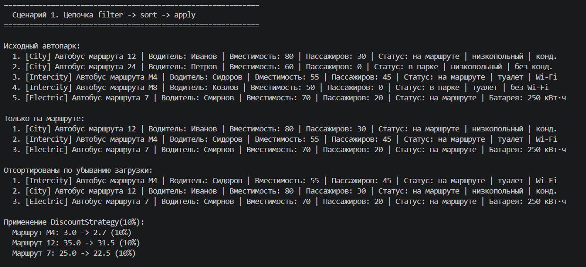

# Лабораторная работа №5
## Функции как аргументы. Стратегии и делегаты

### Цель работы
Освоить передачу функций как аргументов, применение встроенных функций высшего порядка (`map`, `filter`, `sorted`), реализацию паттерна «Стратегия» и интеграцию функционального стиля с объектно-ориентированным кодом из предыдущих лабораторных работ.

### Предметная область
**Транспорт** – используются классы автобусов, созданные в ЛР1–ЛР3:
- `Bus` (базовый), `CityBus`, `IntercityBus`, `ElectricBus`
- Коллекция `Fleet` из ЛР2 расширена методами `sort_by`, `filter_by`, `apply`

### Реализованные функции и стратегии

Все стратегии и обработчики вынесены в `strategies.py` и задокументированы.

#### Стратегии сортировки (key‑функции)
| Функция            | Описание                                      |
|-------------------|-----------------------------------------------|
| `by_route_number` | Сортировка по номеру маршрута (строка)        |
| `by_capacity`     | Сортировка по вместимости                     |
| `by_speed`        | Сортировка по средней скорости               |
| `by_fill_ratio`   | Сортировка по доле занятых мест              |
| `by_driver_name`  | Сортировка по имени водителя (без учёта регистра) |

#### Функции-фильтры (предикаты)
| Функция             | Описание                                              |
|---------------------|-------------------------------------------------------|
| `is_city_bus`       | Только городские автобусы (`CityBus`)                |
| `is_intercity_bus`  | Только междугородние (`IntercityBus`)                |
| `is_electric_bus`   | Только электробусы (`ElectricBus`)                   |
| `is_on_route`       | Автобус находится на маршруте                        |
| `has_free_seats`    | Есть свободные места                                 |

#### Фабрики функций (замыкания)
- `make_capacity_filter(min_capacity)` – создаёт фильтр по минимальной вместимости
- `make_route_filter(route_number)` – создаёт фильтр по точному номеру маршрута

#### Callable-объекты (паттерн «Стратегия»)
- `DiscountStrategy(discount_percent)` – при вызове возвращает информацию о старой и новой цене проезда (не модифицирует объект)
- `ActivateAllStrategy` – переводит все автобусы (имеющие водителя) в состояние «на маршруте»
- `SortByCapacityCallable` – пример callable‑объекта, который можно использовать как key‑функцию

#### Интеграция с коллекцией
В расширенный класс `Fleet` добавлены три метода:
- `sort_by(key_func)` – сортирует **на месте**, возвращает `self` для цепочек
- `filter_by(predicate)` – возвращает **новый** объект `Fleet` с элементами, удовлетворяющими предикату
- `apply(func)` – вызывает переданную функцию для каждого элемента, возвращает `self`

Цепочка операций выглядит так:
```python
result = (collection
    .filter_by(is_on_route)
    .sort_by(by_fill_ratio)
    .apply(activator))
```

### Демонстрация работы (demo.py)
В demo.py реализовано три сценария.

**Сценарий 1 – Полная цепочка filter → sort → apply**
- Исходная коллекция из 5 разнотипных автобусов.

- Фильтрация filter_by(is_on_route) – оставляет только автобусы на маршруте.

- Сортировка sort_by(lambda b: -by_fill_ratio(b)) – по убыванию загрузки.

- Применение callable‑стратегии DiscountStrategy(10) к каждому элементу (без изменения коллекции, вывод расчёта).



**Сценарий 2 – Взаимозаменяемость стратегий**
- Одна и та же коллекция сортируется тремя разными стратегиями (по маршруту, вместимости, скорости) через один и тот же метод sort_by.

- Демонстрируется замена предиката фильтрации: сначала is_city_bus, затем is_electric_bus.


**Сценарий 3 – map, фабрики, lambda и callable‑объекты**
- Применение map для преобразования автобусов в словари и извлечения отдельных полей.

- Использование фабрики make_capacity_filter(60) для создания фильтра.

- Сравнение сортировки через именованную функцию by_fill_ratio и через lambda – результат идентичен.

- Callable‑объект ActivateAllStrategy применяется ко всей коллекции, изменяя состояние объектов.


### Выводы
В ходе лабораторной работы были изучены:

- передача функций как аргументов (ссылки на функции, а не их вызов);

- использование встроенных функций высшего порядка sorted(), filter(), map();

- создание собственных замыканий и фабрик функций;

- применение lambda‑выражений для простых одноразовых операций;

- паттерн «Стратегия», реализованный как через обычные функции, так и через callable‑объекты;

- интеграция функционального подхода в объектно‑ориентированный код коллекции, обеспечивающая гибкость и переиспользование кода.

Все требования на оценку «5» выполнены. Коллекция Fleet поддерживает цепочки операций, стратегии вынесены в отдельный модуль и задокументированы, продемонстрирована полная совместимость с иерархией классов из ЛР3.