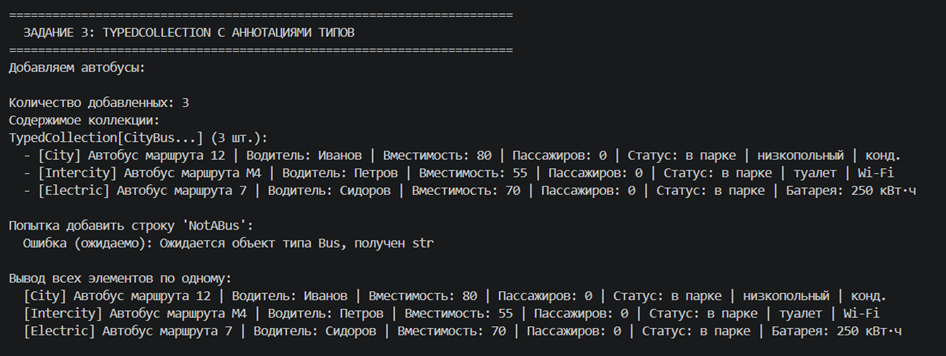
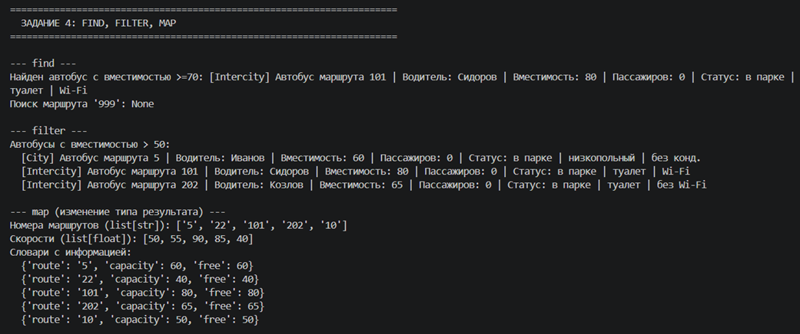
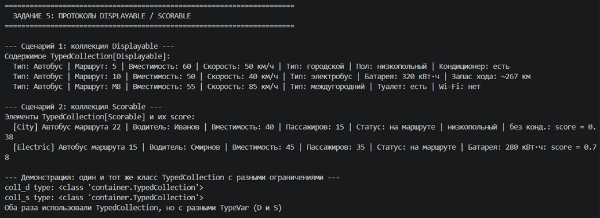

# Лабораторная работа №6
## Generics и typing

### 1. Цель работы
Освоить систему аннотаций типов в Python (typing):
- создание обобщённых (generic) классов с помощью `TypeVar` и `Generic`;
- применение протоколов (`typing.Protocol`) для структурной типизации;
- аннотирование существующего объектно-ориентированного кода (классы автобусов из ЛР-1, ЛР-3 и коллекция из ЛР-2).

### 2. Описание реализованных типов и контейнеров

#### 2.1. Аннотированные классы автобусов
Все классы (`Bus`, `CityBus`, `IntercityBus`, `ElectricBus`) из предыдущих лабораторных работ дополнены полными аннотациями типов: параметры конструктора, возвращаемые значения методов, приватные атрибуты в `__init__`. Добавлены методы для соответствия протоколам:
- `display() -> str` – возвращает строку с информацией об автобусе (вызывает `display_info()`).
- `score() -> float` – возвращает коэффициент заполненности автобуса (число от 0 до 1).

Эти методы позволяют объектам классов участвовать в структурной типизации через протоколы, **без явного наследования** от них.

#### 2.2. Обобщённая коллекция `TypedCollection[T]`
Повторяет интерфейс контейнера `Fleet` из ЛР-2, но является generic-классом, параметризованным типом хранимых элементов (`T`).  
**Возможности:**
- все базовые операции: `add`, `remove`, `remove_at`, `get_all`;
- поиск по атрибутам, характерным для автобусов (`find_by_route_number`, `find_by_driver_name`, `find_by_capacity_range`);
- фильтрация по состоянию (`get_on_route`, `get_in_depot`, `get_by_efficiency`);
- сортировка (`sort_by_route_number`, `sort_by_capacity`, `sort_by_speed`, общий `sort`);
- **новые методы (задание 4):**
    - `find(predicate: Callable[[T], bool]) -> Optional[T]` – первый подходящий элемент или `None`.
    - `filter(predicate: Callable[[T], bool]) -> list[T]` – все подходящие элементы.
    - `map(transform: Callable[[T], R]) -> list[R]` – преобразование элементов, тип результата может быть **другим** (используется `TypeVar('R')`).

#### 2.3. Использованные TypeVar и их ограничения
- `T = TypeVar('T')` – основной параметр типа коллекции, не имеет ограничений.
- `R = TypeVar('R')` – используется в методе `map` для типа результата.
- `D = TypeVar('D', bound=Displayable)` – ограничение: только объекты с методом `display() -> str`.
- `S = TypeVar('S', bound=Scorable)` – ограничение: только объекты с методом `score() -> float`.

Благодаря этому `TypedCollection[D]` гарантирует (на уровне статического анализа), что у элементов можно безопасно вызвать `display()`, даже если они принадлежат разным веткам иерархии и не связаны общим предком.

#### 2.4. Протоколы (задание 5)
Определены два протокола:
```python
class Displayable(Protocol):
    def display(self) -> str: ...

class Scorable(Protocol):
    def score(self) -> float: ...
```
Классы CityBus, IntercityBus, ElectricBus не наследуются от этих протоколов, но обладают нужными методами, поэтому полностью соответствуют им структурно. Это продемонстрировано в сценариях с TypedCollection[D] и TypedCollection[S].

#### 3. Демонстрация работы
В файле demo.py реализованы три сценария, соответствующие уровням оценки.

**Сценарий 1 – Базовая типизация (задание на 3)**
- Создаётся TypedCollection[Bus].

- В коллекцию добавляются городской, междугородний и электрический автобусы.

- Выводится количество элементов и содержимое.

- Предпринимается попытка добавить строку – ошибка.

- Все элементы извлекаются через get_all() и печатаются.



**Сценарий 2 – find, filter, map (задание на 4)**
- Создаётся коллекция из пяти автобусов разных типов.

- find: ищется первый автобус с вместимостью ≥70 (найден) и маршрут '999' (отсутствует → None).

- filter: отбираются автобусы с вместимостью >50, результат выводится.

- map:

- Извлечение номеров маршрутов → list[str].

- Извлечение скоростей → list[float].

- Преобразование в список словарей с полями.
- Везде продемонстрировано изменение типа результата.



**Сценарий 3 – Протоколы Displayable и Scorable (задание на 5)**
- Сценарий 3a (Displayable): создаётся TypedCollection[D], в неё помещаются CityBus, IntercityBus и ElectricBus. Для каждого элемента вызывается display() – метод работает, хотя классы не наследуются от Displayable.

- Сценарий 3b (Scorable): создаётся TypedCollection[S], добавляются CityBus и ElectricBus с предварительно посаженными пассажирами. У каждого вызывается score(), показывается коэффициент заполненности.

- В конце выводится тип коллекций, подтверждая, что используется один и тот же класс TypedCollection, но с разными параметрами TypeVar.



4. Вывод
В ходе лабораторной работы:

- Изучена система аннотаций типов Python, позволяющая описывать ожидаемые типы аргументов и возвращаемых значений.

- Создан обобщённый класс TypedCollection с параметром типа T, что сделало контейнер из ЛР-2 типобезопасным и переиспользуемым.

- Применены TypeVar (T, R, D, S), включая ограничения bound, которые сужают допустимые типы на основе структурных протоколов.

- Реализована структурная типизация через Protocol: объекты разных классов из иерархии ЛР-3 успешно использованы с TypedCollection[Displayable] и TypedCollection[Scorable] без необходимости вводить искусственное наследование.

- Методы find, filter и map добавлены с корректными аннотациями, причём map демонстрирует смену типа результата с помощью второго TypeVar.

- Аннотации типов и обобщённые классы значительно повышают читаемость кода и позволяют инструментам статического анализа (mypy, pyright) находить ошибки на ранних этапах разработки.