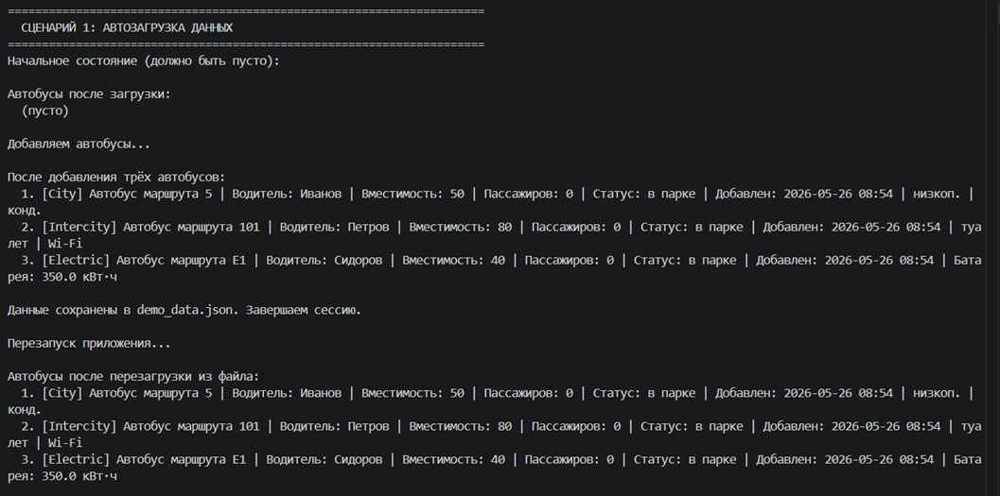
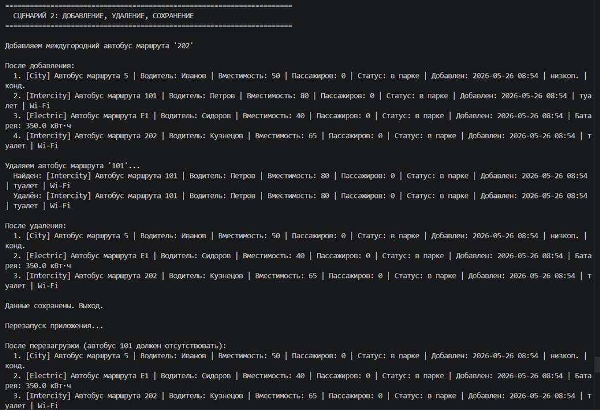
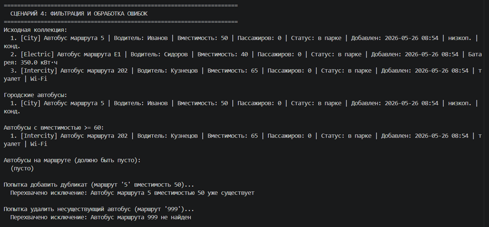

# Лабораторная работа №7
## Консольное приложение для управления автопарком

### 1. Цель работы
Объединить знания, полученные в ЛР1–ЛР6, в единое интерактивное консольное приложение. Реализован CLI-интерфейс с меню, разделение на слои (cli, app, models, storage, exceptions), собственные исключения, операции поиска, фильтрации, сортировки, а также сохранение и загрузка данных в формате JSON. Приложение полностью типизировано и документировано.

### 2. Структура проекта

## 2. Структура проекта

```plaintext
python_labs/
├─ README.md
├─ src/
│  ├─ lib/
│  ├─ lab01/
│  ├─ lab02/
│  ├─ lab03/
│  ├─ lab04/
│  ├─ lab05/
│  ├─ lab06/
│  ├─ lab07/
│  │   ├─ README.md
│  │   ├─ main.py          # точка входа, запуск CLI
│  │   ├─ cli.py           # интерфейс: меню, ввод, вывод
│  │   ├─ app.py           # бизнес-логика, управление данными
│  │   ├─ exceptions.py    # собственные исключения
│  │   └─ storage.py       # сохранение/загрузка данных
└─ images/
   └─ lab07/
```

**Назначение модулей:**
- `main.py` – запускает CLI.
- `cli.py` – весь ввод/вывод, обработка команд пользователя. Не содержит бизнес-логики.
- `app.py` – класс `App`, управляющий коллекцией автобусов: добавление, удаление, поиск, фильтрация, сортировка, загрузка/сохранение.
- `models.py` – иерархия классов автобусов (ЛР1–ЛР3) с методами сериализации `to_dict`/`from_dict` и полем `created_at`.
- `exceptions.py` – `ItemNotFoundError`, `DuplicateItemError`.
- `storage.py` – функции `save` и `load` для работы с JSON-файлом.

### 3. Описание CLI
Реализовано главное меню из 6 пунктов:

1. **Добавить автобус** – выбор типа (городской, междугородний, электробус), ввод параметров, обработка `DuplicateItemError`.
2. **Показать все автобусы** – форматированный вывод списка.
3. **Найти автобус по маршруту** – поиск по номеру маршрута.
4. **Удалить автобус** – поиск, отображение, подтверждение `y/n`, удаление.
5. **Фильтрация автобусов** – подменю: по типу, по диапазону вместимости, по статусу (на маршруте/в парке).
6. **Сортировка автобусов** – выбор поля (маршрут, вместимость, скорость, дата добавления) и порядка, сортировка на месте и вывод.
0. **Выход** – автоматическое сохранение в `data.json`.

**Обработка ошибок ввода:** все числовые вводы защищены от `ValueError`, проверяются допустимые диапазоны. При добавлении перехватываются исключения валидации и дубликатов.

**Сохранение/загрузка (оценка 5):**
- При запуске данные автоматически загружаются из `data.json` (если файл отсутствует – коллекция пуста).
- При выборе пункта «0. Выход» данные сохраняются.
- Используется универсальная сериализация через `to_dict()` / `from_dict()`.

### 4. Демонстрация работы

Здесь запись консоли через PowerSession, запись демонстрации: 

[](https://asciinema.org/a/XDYUzpKYnPS8RLU5)

Ниже приведены сценарии с описанием и скриншотами терминала.

#### Сценарий 1: Запуск, автозагрузка, вывод коллекции
Первый запуск – коллекция пуста. Добавляем несколько автобусов разных типов, выходим (сохраняем). Повторный запуск – данные загружены, отображается коллекция.



#### Сценарий 2: Добавление, редактирование (удаление с подтверждением), выход, повторный запуск
Добавлен автобус, затем удалён с подтверждением. Выход с сохранением. Повторный запуск – удалённый автобус отсутствует.



#### Сценарий 3: Сортировка с выбором стратегии
Коллекция из нескольких автобусов. Выполнена сортировка по вместимости (по убыванию), затем по дате добавления (по возрастанию). Результаты выводятся на экран.


#### Сценарий 4: Фильтрация + перехват исключения при некорректных данных
Фильтрация по типу «Электробус», затем по диапазону вместимости. Попытка добавить дубликат перехватывается `DuplicateItemError`.



### 5. Вывод
В ходе лабораторной работы изучено:
- разбиение приложения на модули и слои (cli, app, models, storage);
- реализация интерактивного CLI-интерфейса с обработкой ошибок ввода;
- создание и использование собственных исключений;
- сохранение и загрузка данных в JSON;
- полная типизация всех публичных методов и функций (аннотации типов);
- документирование кода с помощью docstring;
- реализация подтверждения опасных операций.

Приложение соответствует всем требованиям на оценку «5».